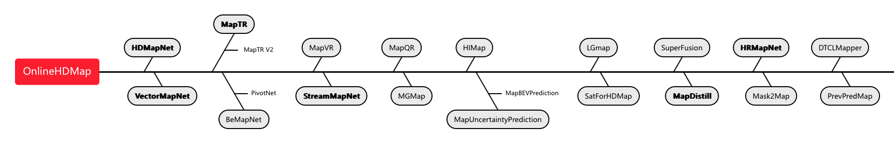

Awesom high definition map methods collection with detailed interpretations of some key papers.

### 1. Online HD Map

#### 1.1 Roadmap

#### 1.2 Paper list

HDMapNet: An Online HD Map Construction and Evaluation Framework [[code](https://github.com/Tsinghua-MARS-Lab/HDMapNet)] ICRA 2022, CVPR 2021

VectorMapNet: End-to-end Vectorized HD Map Learning [[code](https://github.com/Mrmoore98/VectorMapNet_code)] ICML 2023

MapTR: Structured Modeling and Learning for Online Vectorized HD Map Construction [[code](https://github.com/hustvl/MapTR)] ICLR2023

MapTRv2: An End-to-End Framework for Online Vectorized HD Map Construction [[code](https://github.com/hustvl/MapTR/tree/maptrv2)]

MapVR: Online Map Vectorization for Autonomous Driving: A Rasterization Perspective[[code](https://github.com/jiahaoLjh/MapVectorizationEvalToolkit)1, [code2](https://github.com/ZhangGongjie/MapVR)] NIPS2023

BeMapNet: End-to-End Vectorized HD-Map Construction With Piecewise Bezier Curve [[code](https://github.com/er-muyue/BeMapNet)] CVPR2023

PivotNet: Vectorized Pivot Learning for End-to-end HD Map Construction ICCV2023 [[code](https://github.com/wenjie710/PivotNet)] ICCV2023

StreamMapNet: Streaming Mapping Network for Vectorized Online HD Map Construction [[code](https://github.com/yuantianyuan01/StreamMapNet)] WACV 2024

SuperFusion: Multilevel LiDAR-Camera Fusion for Long-Range HD Map Generation [[code](https://github.com/haomo-ai/SuperFusion)] ICRA 2024

EAN-MapNet: Efficient Vectorized HD Map Construction with Anchor Neighborhoods

MGMap: Mask-Guided Learning for Online Vectorized HD Map Construction [[code](https://github.com/xiaolul2/MGMap)] CVPR2024

HIMap: HybrId Representation Learning for End-to-end Vectorized HD Map Construction[[code](https://github.com/BritaryZhou/HIMap), not release] CVPR2024

MapVision: CVPR 2024 Autonomous Grand Challenge Mapless Driving Tech Report CVPR2024

HybriMap: Hybrid Clues Utilization for Effective Vectorized HD Map Construction

DTCLMapper: Dual Temporal Consistent Learning for Vectorized HD Map Construction [[code](https://github.com/lynn-yu/DTCLMapper)] IEEE T-ITS2024

MapQR: Leveraging Enhanced Queries of Point Sets for Vectorized Map Construction [[code](https://github.com/HXMap/MapQR)] ECCV2024

HRMapNet：Enhancing Vectorized Map Perception with Historical Rasterized Maps [[code](https://github.com/HXMap/HRMapNet?tab=readme-ov-file)] ECCV2024

Mask2Map: Vectorized HD Map Construction Using Bird’s Eye View Segmentation Masks [[code](https://github.com/SehwanChoi0307/Mask2Map) ,not release] ECCV2024

Accelerating Online Mapping and Behavior Prediction via Direct BEV Feature Attention [[code](https://github.com/alfredgu001324/MapBEVPrediction)] ECCV2024

MapTracker: Tracking with Strided Memory Fusion for Consistent Vector HD Mapping [[code](https://github.com/woodfrog/maptracker)] ECCV2024 **oral**

PriorMapNet: Enhancing Online Vectorized HD Map Construction with Priors

PrevPredMap: Exploring Temporal Modeling with Previous Predictions for Online Vectorized HD Map Construction

Driving with Prior Maps: Unified Vector Prior Encoding for Autonomous Vehicle Mapping

Neural HD Map Generation from Multiple Vectorized Tiles Locally Produced by Autonomous Vehicles

#### 1.3 Auxiliary Knowledge or methods (Distillation) 

MapDistill：Boosting Efficient Camera-based HD Map Construction via Camera-LiDAR Fusion Model Distillation [[code](https://github.com/Ricky-Developer/MapDistill)]ECCV 2024.

P-MapNet: Far-seeing Map Constructer Enhanced by both SDMap and HDMap Priors [[code](https://github.com/jike5/P-MapNet)]（ICLR2024被拒）

SatForHDMap: Complementing Onboard Sensors with Satellite Map: A New Perspective for HD Map Construction [[code](https://github.com/xjtu-cs-gao/SatforHDMap)] ICRA 2024

Enhancing Online Road Network Perception and Reasoning with Standard Definition Maps

### 2. 衍生工作

#### 2.1 鲁棒性

Is Your HD Map Constructor Reliable under Sensor Corruptions? [[code](https://github.com/mapbench/toolkit)] 这篇蛮有意思，后续工作适合做场景迁移、半监督学习

#### 2.2 矢量化场景表示

VAD: Vectorized Scene Representation for Efficient Autonomous Driving [[code](https://github.com/hustvl/VAD)] ICCV2023 (MapTR同作)

Is Ego Status All You Need for Open-Loop End-to-End Autonomous Driving? [[code](https://github.com/NVlabs/BEV-Planner)] VAD -> BEV-Planner

#### 2.3 车道线角度角度

OpenLane-V2: A Topology Reasoning Benchmark for Unified 3D HD Mapping [[code](https://github.com/OpenDriveLab/OpenLane-V2)] NeurIPS 2023

#### 2.4 AIGC相关

AIGC： Panacea: Panoramic and Controllable Video Generation for Autonomous Driving [[code](https://panacea-ad.github.io/)] 

#### 2.5 众包建图优化

CrowdSourcing Live High Definition Map via Collaborative Computation in Automotive Edge Computing

Edgemap: Crowdsourcing high definition map in automotive edge computing

VI-Map: Infrastructure-Assisted Real-Time HD Mapping for Autonomous Driving

### 3. 资源开销统计

| 算法        | 训练资源                                                     |
| ----------- | ------------------------------------------------------------ |
| BEVFormer   | 8 GPUs  后续较多工作都是基于BEVFormer，基本都是8卡起步       |
| BEVDistill  | 8 NVIDIA A100 GPUs                                           |
| HDMapNet    | 这篇是属于分割方法论的，所以训练开销明显少一些，bs默认4      |
| MapTR v1/v2 | 8 NVIDIA GeForce RTX 3090 GPUs                               |
| MapDistill  | 8 NVIDIA RTX A6000 GPUs                                      |
| HRMapNet    | 8 NVIDIA A100 GPUs bs 8 × 4                                  |
| P-MapNet    | 4 NVIDIA GeForce RTX 3090 GPUs，基于HDMapNet，所以开销也不高 |
| MGMap       | 8 NVIDIA Tesla **V100** GPUs bs 8x6                          |

### 4. Reference Repo

https://github.com/LoveFaFa2333/Awesome-Online-HDMap

https://github.com/Honminden/awesome-hd-map-construction
