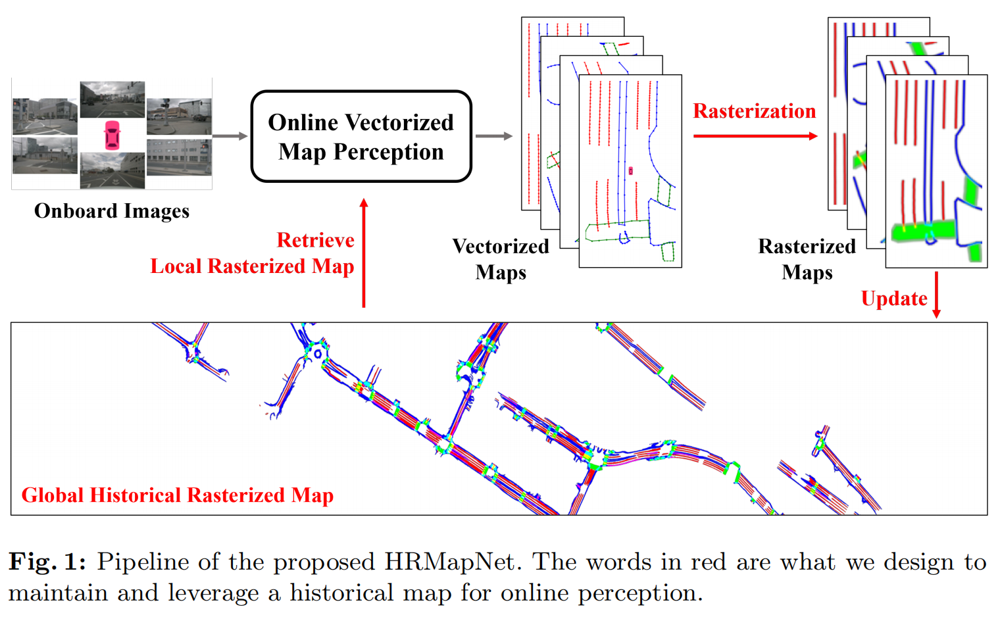

# Enhancing Vectorized Map Perception with Historical Rasterized Maps

 **[code](https://github.com/HXMap/HRMapNet) ECCV 2024**

### 背景

无图NOA（Navigate On Autopilot）以来，Online HDMap受到广泛关注，但是当前方法在恶劣条件下鲁棒性较差，港中文和上交提出了HRMapNet，这个网络利用低成本的**历史栅格化地图（Historical** **Rasterized Map****）**来加强矢量化Online HDMap的感知构建，它可以容易的从旧的矢量化结果获取，提供高价值的补充，本文提出两个模块来加强BEV特征和Map element的Query：

- BEV特征：使用一个特征聚合模块来融合当前image特征和历史map特征
- map element     Query：设计了一个Query初始化模块来服用历史map的Query先验信息

这两个模块便于集成，它的方法脉络是：MapTR-> MapQR -> HRMapNet，实验了Nuscenes和Argoverse2。

### 前言

HD map通常由矢量化的地图元素（车道线、人行道、道路边缘）的位置和结构组成，传统的HD map通常离线构建，使用Slam进行建图，并进行人工或自动化的标注工具进行标注和矢量化表示，是比较复杂的pipline。它的构建和维护成本都较高，而且需要一定的法律资质。因此近年来Online的方式受到广泛关注。

HDMap的矢量化表示对下游的规控比较友好，一些现有的工作（HDMapNet）把HDMap用分割的方法来解决，rasterized map是map分割图的下游产物，它将map用BEV网格来表示，标记每个网格的像素语义。但是它缺乏instance信息，需要比较复杂的后处理。

MapTR 等方法将高清地图感知定义为一个点集预测任务，并利用DETR的方法论直接预测BEV视图中的矢量化地图元素，后续诸多方法（PivotNet、VectorMapNet、MapTRv2、Scalablemap、MapVR）都基于此进行了迭代。然而端侧的Online传感器会存在较多的不确定性，影响了在线建图的精度和鲁棒性。

本文提出了HRMapNet，利用全局历史栅格化地图来强化矢量化地图构建，栅格化地图的优势：矢量化地图很容易栅格化；栅格化地图很容易进行全局合并和检索；栅格化地图可以为矢量化地图提供强先验知识；栅格化地图只需要很少的内存占用；同时，多个在线车辆一起构建历史地图，可以很容易的实现众包信息（crowdsourcing information）构建。具体方法是通过两个模块来实现：

- Map feature aggregation模块：fuse图像特征和rasterized map，弥补了Online     map的特征不足问题；
- Query init prior模块：通过encode检索到的栅格化地图形成prior embedding，由此初始化Query模块，提升Query的先验。

 

### 相关工作

- BEV 特征构建

​	主要是LSS的方法和基于BEV Query的Transformer结构方法

- 单帧的地图感知

​	早期地图构建主要关注lane检测、道路拓扑结构推理、或者map分割，这些方法能够构建栅格化地图，但是需要比较复杂的后处理形成矢量化的Map element，供下游任务使用。后续MapTR、VectorMapNet提供了直接 输出矢量化地图元素的方法，

- 复杂信息的地图感知

​	P-MapNet（CVPR2023）使用额外的Standard defintion map（SD Map）来帮助HD Map提升精度；

​	

