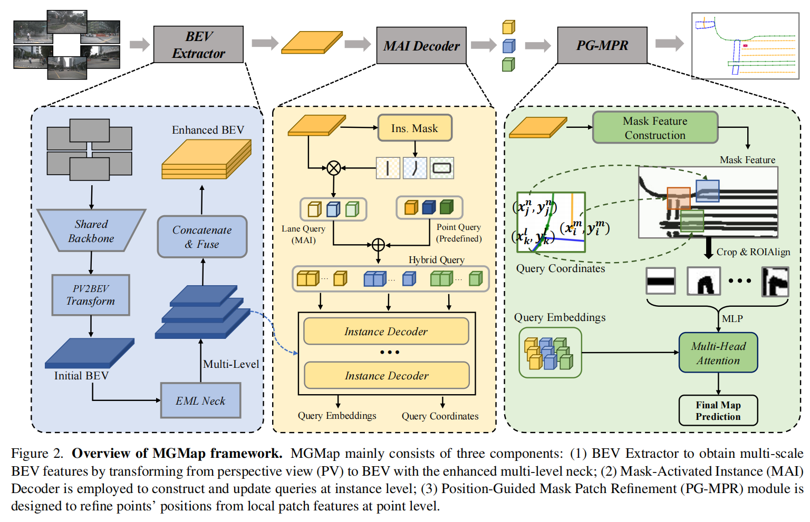

# MGMap: Mask-Guided Learning for Online Vectorized HD Map Construction 

**[[code](https://github.com/xiaolul2/MGMap)] CVPR2024**

### 背景

Map elements包含了较强的形状先验，当前Online HDMap的构建方式大多基于检测范式，Map elements这样微小且稀疏的标注在这个范式下定位和细节都会产生较大损失。为此提出了MGMap，这是一个mask-guided的方法，通过学习到的mask，有效地突出信息区域，实现精确的地图元素定位。具体来说，MGMap有两个层次的mask学习：

* instance level

  提出了mask-activated instance（MAI）decoder，通过激活实例掩码，将全局实例和结构信息合并到实例查询中。

* point level

  提出了position-guided mask patch refinement（PG-MPR）模块，细粒度的提升点的定位能力，提取特定点的patch信息。

和Baseline相比，多模态输入的方法有10+的mAP提升（这里对比的Baseline应该是MapTR）。

### 引言和相关工作

### 方法

### 实验

