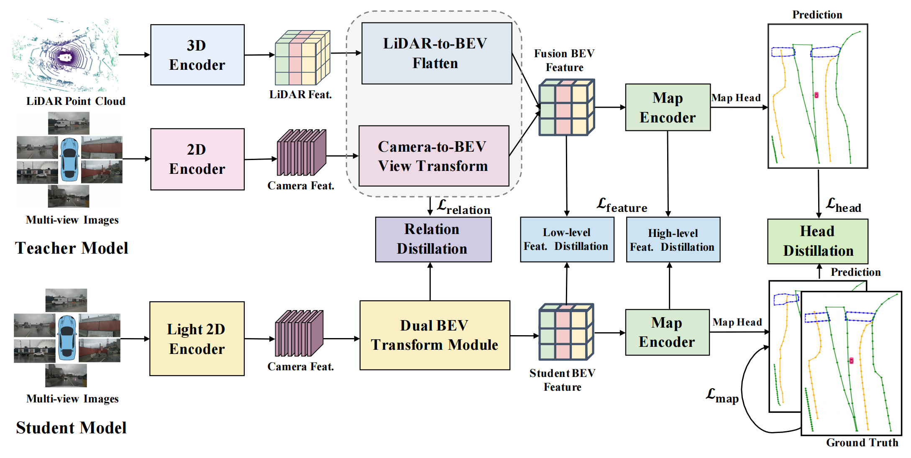

# MapDistill

Boosting Efficient Camera-based HD Map Construction via Camera-LiDAR Fusion Model Distillation

[[code](https://github.com/Ricky-Developer/MapDistill) ,not release] [ECCV2024](https://arxiv.org/abs/2407.11682)

### 背景

尽管3D 目标检测领域KD方法挺多的，但是HD map的研究还属空白。本文属于填空题。

### 引言和相关工作

### 方法

Teacher是Fusion-Based模型，student为camera-only模型，使用了三个层次的蒸馏：cross-model 关系蒸馏、dual-level特征蒸馏、map head蒸馏。

* Fusion-Based Teacher 模型

使用SOTA的camera-LIDAR MapTR模型作为Teacher，它包含camera分支和LIDAR分支，camera分支使用ResNet50提取多视角特征，使用GKT进行2D to BEV进行视角转换。LIDAR分支使用second作为backbone，采集得到voxel特征，然后通过Flatten操作（BEVFusion）投影到BEV空间。得到camera和LIDAR的BEV特征表示为：
$$
F_{C_{BEV}}^T \in R^{H×W×C}, F_{L_{BEV}}^T \in R^{H×W×C}
$$
上述特征进行concat后经过一个全连接网络融合得到融合后特征：
$$
			F_{fused}^T \in R^{H×W×C}
$$
然后接入Map相关的模块：主要是Map Encoder和Map Header，Map Encoder先从融合特征提取到High-Level的特征：
$$
F_{high}^T=MapEnc(F_{fused}^T )
$$
Map Header最终输出分类和point 分支，产生Map elements类别和点位置信息：
$$
			F_{cls}^T, F_{point}^T=MapHead(F_{high}^T)
$$

- Camera Based student模型

使用ResNet18作为backbone，后续会接**Dual BEV 转换模块**，这个模块其实就是GKT叠加了LSS，人为的制造两种不同的BEV特征空间。 然后用类似Teacher的fuse方法把两个BEV空间进行融合。后续其他处理步骤是一致的。

- 三种蒸馏
  - Cross-modal relation 蒸馏

### 实验

