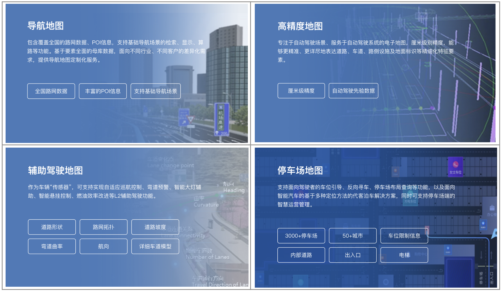
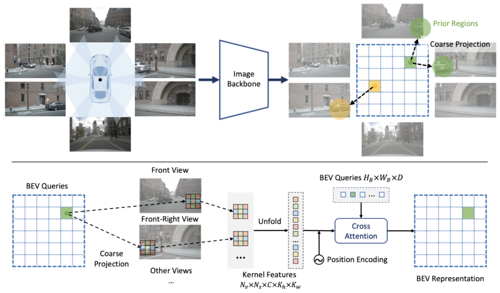

# MapTR

**MapTR: Structured Modeling and Learning for Online Vectorized HD Map Construction [[code](https://github.com/hustvl/MapTR)] ICLR2023**

**MapTRv2: An End-to-End Framework for Online Vectorized HD Map Construction [[code](https://github.com/hustvl/MapTR/tree/maptrv2)]**

### 背景

华科+地平线的工作，这项工作属于Online HDMap里程碑式的工作。驾驶场景相关的地图（[四维图新](https://www.navinfo.com/map-products)）主要有以下形式：

其中高精地图（HD Map）提供了丰富而精确的驾驶场景环境信息（厘米级），是自动驾驶系统规划的一个基本和不可或缺的组成部分。在生产环境中和HD Map相关的企业主要是图商和自动驾驶公司，图商通常使用传统的建图方法维护离线的高精度地图，主要流程是：通过点云、图像、GPS、IMU等传感器采集数据；通过slam等方法定位、建图；生成点云地图；通过点云地图构建矢量化地图元素。  这一传统方法有比较明显的劣势：开销大; 建图流程复杂; 地图更新不及时，扩展性有限; 法律法规限制等。

因此，Online的HD Map构建方法逐渐成为热点，它通过端到端的在线构建局部高精地图，具有：开销低、自动化程度高；没有更新和扩展的局限性，提供了后续规划控制的便利性。

回顾到本文，MapTR提出了一个端到端的Transformer Online 矢量化HDMap构建方法，对于地图中的element

### 引言和相关工作

### 方法

- BEV空间构造

  只采用图像分支生成BEV特征，利用他们之前的工作[GKT](onenote:#综述调研&section-id={7FE3ADD0-8305-4D29-B47D-77C6C0B28C9C}&page-id={FE1B94E8-E93D-7F43-A5F0-FCBDB6D72C3A}&object-id={9167445D-D207-C242-840A-DA9478A79630}&1D&base-path=https://d.docs.live.net/a8595e7ec3ee51a3/文档/AI4D/HDMap.one)实现PV2BEV的转换。GKT看起来和BEVFormer的转换方法是比较接近的。不过它的采样不是通过deformable去grid sample的，而是通过投影去查找的。具体先确定一个BEV Query矩阵，通过内外参建立BEV grid和2D像素之间的映射关系，提取核区域的特征，和BEVQuery做cross-attention，得到BEV特征。

  

* 

### 实验
