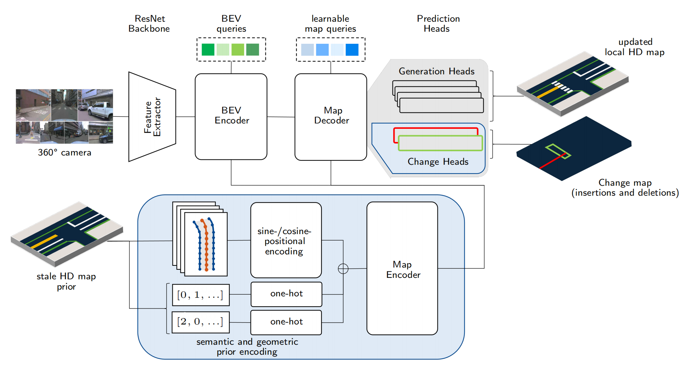

23. **GNMap: Neural HD Map Generation from Multiple Vectorized Tiles Locally Produced by Autonomous Vehicles [Arxiv](https://www.arxiv.org/abs/2409.03445)**

四维图新的作品，主要研究自动构建**全局**HD Map。

现有的矢量化地图生成方法在**单次行程**中只能产生车辆周围约65%的局部地图元素，难以构建高质量的**Global HD Map**，因此提出了**GNMap**实现端到端的基于生成式神经网络的全局HD Map构建，方法主要利用自动驾驶车辆**多次行程**中产生的多个Local矢量化地图块来实现全局信息的补全。使用多层注意力自编码器作为共享网络，通过预训练、微调来学习参数，以确保生成地图的完整性和元素类别的正确性，本方法在四维图新进行了部署，是自动构建HD Map的重要软件。如图为pretrain和finetune阶段的算法pipline。

| pretrain阶段的处理pipline，通过mask的方法预训练autoencoder。 | finetune阶段的pipline，输入pretrain的权重，旨在加强element的分类精度。 |
| ------------------------------------------------------------ | ------------------------------------------------------------ |
|  |  |

24. **Online Temporal Fusion for Vectorized Map Construction in Mapless Autonomous Driving [Arxiv](https://arxiv.org/abs/2409.00593)**

武大团队，主要研究Online HD Map的temporal融合方法。

Online HD Map构建成为自动驾驶的研究主流方向，当前方法大多依赖单帧输入，这影响了复杂场景下HD Map构建的鲁棒性。本文提出了一种利用**长时序信息**来构建一致性矢量化地图的Online HDMap构建方法，方法主要分为三步：一是特征构建层次，将现有网络（MapTR）检测到的道路元素融合到语义体素地图中，融合主要通过哈希表将稀疏的element语义映射到voxel grid中；二是对融合的体素信息进行检查得到可靠的voxel，通过聚类的形成道路标记的实例级表示；最后结合相关领域知识来估计道路的几何和拓扑结构，生成的结构直接应用于规划和控制模块（PnC）。本方法核心创新点在于利用了temporal的信息，提高了建图的准确性和一致性。

25. **GenMapping: Unleashing the Potential of Inverse Perspective Mapping for Robust Online HD Map Construction [[code](https://github.com/lynn-yu/GenMapping) not release]  [Arxiv](https://arxiv.org/abs/2409.08688)**

    湖大团队，主流的Online HD Map方法系列，实验对比到了StreamMapNet，24年CVPR和ECCV的几篇比较新的方法也都提到了，本文方法为camera only。

    Online HD Map因其更新灵活和低维护成本逐渐成为autonomous的首选方案，然而当前主流的方法大多在训练中耦合了**相机的内外参**，导致在应用于不同参数的视觉传感器时泛化性能显著下降。本文提出通过逆透视变换（IPM）的方法将相机参数从训练过程中解耦，设计了一个新的通用地图生成框架GenMapping，它包含一主两辅三个分支：**主分支**学习IPM变化后粗糙道路图像中的鲁棒全局特征，两个辅助分支分别是**密集透视**分支和**稀疏先验**分支，**密集透视**分支挖掘静态和动态物体之间的关系，**稀疏先验**分支引入了OpenStreetMap（OSM）作为先验知识，最后通过三分支融合模块整合不同空间的特征。为了进一步加强泛化能力，提出了交叉视图地图学习方法（CVML）实现共同空间内的联合学习，此外还提出了双向数据增量（BiDA）模块来减轻对数据集的依赖。本方法为语义地图和矢量化地图的SOTA（2409）。

    

    

26. GlobalMapNet: An Online Framework for Vectorized Global HD Map Construction [Arxiv](https://arxiv.org/abs/2409.10063)

    复旦团队，这篇看起来是AAAI的投稿。本文声明为第一篇Online框架的矢量化**全局高精地图**构建方法。

    传统的高精地图制作昂贵且耗时，近年来，众包和在线高精地图作为替代方法受到较多关注，但是它们也有各自局限性，本文提出了一种新的方法：Global Map Construction（GlobalMapNet），它结合了众包和Online mappping的优点，直接构建全局矢量化地图。提出了一种基于“静态地图假设”的方法，即从Global视角来看，真实地图在一定时期内保持不变。基于此，提出了 GlobalMapNet，不断更新和利用Global地图，产生一致的感知结果，同时还提出了Global Map的evaluation指标：全局平均精度（GAP）。具体来说包含了**GlobalMapBuilder和GlobalMapFusion**模块，**GlobalMapBuilder**从零开始生成全局地图，它会持续匹配合并局部地图，通过Map NMS方法去除重复的地图元素，生成清晰的地图。**GlobalMapFusion**用于聚合历史信息，提高预测的一致性。

    本文在行文上摘要、前沿和方法有些脱节，没有具体代码release，对比方法为StreamMapNet。

    

27. ExelMap: Explainable Element-based HD-Map Change Detection and Update [Arxiv](https://arxiv.org/abs/2409.10178)

ECCV2024 ，本文核心讨论的问题是Online更新生成的HD Map还不足以安全部署，讨论了地图元素可解释性对更新的影响。

HDMap的获取和维护是自动驾驶部署的核心问题，当前研究主要集中在两个方向：Online HD Map的生成和HD Map的变化检测更新。现有的方法问题在于生成的地图质量不高，难以安全部署，许多变化检测方法不足以精确定位和提取变化的地图元素，缺乏对元素的可解释，这限制了**众包更新地图**的潜力。本文提出了"可解释的基于元素的HD地图变化检测和更新"这一新任务，提出了ExelMap，一种可解释的基于元素的地图更新策略，它能够识别发生变化的具体地图元素。基于此，讨论了当前metrics对于捕捉变化目标的失效（面对有无先验信息的场景），并基于Argoverse 2 Map Change Dataset中与人行横道相关的真实世界变化进行实验，是首次对真实世界端到端基于元素的HD地图变化检测和更新进行全面的问题调查。

